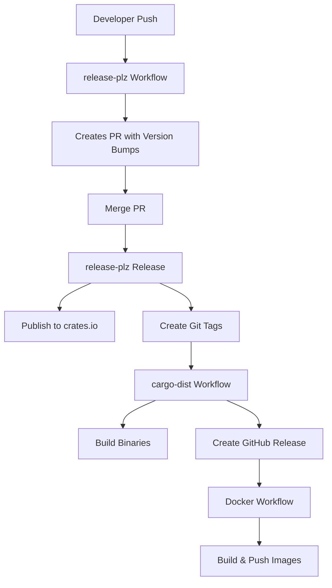

# Release Process Documentation

## Overview

This document describes the complete release process for the redisctl project, including all tools, workflows, and troubleshooting steps.

## Release Architecture



## Tools and Configuration Files

### 1. release-plz
- **Config**: `release-plz.toml`
- **Purpose**: Version management, changelog generation, crates.io publishing
- **Creates**: Git tags, PR with version bumps
- **Does NOT**: Create GitHub releases (delegated to cargo-dist)

### 2. cargo-dist
- **Config**: `dist-workspace.toml`, `.github/workflows/redisctl-release.yml`
- **Purpose**: Build multi-platform binaries, create GitHub releases
- **Triggers**: On git tags matching `redisctl-v*`
- **Creates**: GitHub releases with binary artifacts

### 3. git-cliff
- **Config**: `cliff.toml`
- **Purpose**: Generate changelog content from conventional commits
- **Integration**: Used by release-plz for changelog updates

### 4. Docker
- **Config**: `.github/workflows/docker-publish.yml`
- **Purpose**: Build and push Docker images
- **Triggers**: On release publication, main branch pushes

## Pre-Release Checklist

- [ ] All tests passing on main branch
- [ ] No uncommitted changes
- [ ] Cargo.lock is committed
- [ ] Conventional commits used for all changes
- [ ] No draft releases on GitHub
- [ ] No conflicting tags

## Release Execution Steps

### Automatic Release (Standard Flow)

1. **Development Phase**
   ```bash
   # Make changes using conventional commits
   git add -A
   git commit -m "feat: add new feature"
   git push
   ```

2. **Release PR Creation** (Automatic)
   - release-plz creates PR with version bumps
   - Review changelog content in PR
   - Verify version bumps are correct

3. **Merge Release PR**
   - Merge the release-plz PR to main
   - This triggers the actual release

4. **Monitor Release** (Automatic)
   - Watch GitHub Actions for:
     - release-plz workflow (publishes to crates.io)
     - cargo-dist workflow (builds binaries)
     - docker-publish workflow (builds images)

### Manual Release (Emergency)

If automation fails:

1. **Update Versions**
   ```bash
   # Edit Cargo.toml files manually
   # Update [workspace.package] version
   ```

2. **Create Tag**
   ```bash
   git tag redisctl-v0.2.1
   git push origin redisctl-v0.2.1
   ```

3. **Publish to crates.io**
   ```bash
   cargo publish -p redis-cloud
   cargo publish -p redis-enterprise
   cargo publish -p redisctl
   ```

4. **Trigger Workflows**
   - cargo-dist should trigger on tag
   - Manually dispatch Docker workflow if needed

## Version Strategy

### Version Bumping Rules

- **Patch** (0.1.0 → 0.1.1): Bug fixes
- **Minor** (0.1.0 → 0.2.0): New features, breaking changes in 0.x
- **Major** (0.x.y → 1.0.0): Stable API release

### Workspace Versioning

- All workspace members share the same version initially
- Version defined in `[workspace.package]`
- Internal dependencies use workspace version

## Troubleshooting

### Problem: Empty Changelogs

**Symptom**: CHANGELOG.md files only contain comments

**Solution**:
1. Verify cliff.toml tag pattern matches your tags
2. Test manually: `git cliff --tag-pattern ".*-v[0-9]*"`
3. Ensure conventional commits are used

### Problem: cargo-dist Not Triggering

**Symptom**: No binaries in GitHub release

**Solution**:
1. Check workflow tag trigger pattern
2. Verify tag format matches pattern
3. Manually dispatch workflow if needed

### Problem: Version Conflicts

**Symptom**: "package has different version" error

**Solution**:
```bash
# Delete conflicting tag
git tag -d redisctl-v0.2.0
git push origin :redisctl-v0.2.0

# Reset versions to match crates.io
# Edit Cargo.toml files
```

### Problem: Docker Build Fails

**Symptom**: Docker workflow fails during release

**Solution**:
1. Ensure Cargo.lock is committed
2. Verify Dockerfile builds locally
3. Check Docker Hub credentials

### Problem: Multiple GitHub Releases

**Symptom**: Duplicate or conflicting releases

**Solution**:
1. Ensure only cargo-dist creates GitHub releases
2. Set `git_release_enable = false` in release-plz.toml

## Monitoring and Verification

### During Release

Monitor these GitHub Actions workflows:
1. **release-plz**: Should complete first, publishes to crates.io
2. **Release** (cargo-dist): Builds binaries, creates GitHub release
3. **Docker Publish**: Builds and pushes images

### Post-Release Verification

- [ ] Check crates.io for published versions
- [ ] Verify GitHub release has binaries for all platforms
- [ ] Test Docker image: `docker pull joshrotenberg/redisctl:latest`
- [ ] Verify changelog content in GitHub release
- [ ] Test installation: `cargo install redisctl`

## Rollback Procedure

If a release has critical issues:

1. **Yank from crates.io** (if necessary)
   ```bash
   cargo yank --version 0.2.0 redisctl
   ```

2. **Create Fix**
   ```bash
   git checkout main
   git pull
   # Fix issue
   git commit -m "fix: critical issue"
   git push
   ```

3. **Release Patch Version**
   - Let release-plz create new PR
   - Merge to trigger patch release

## Configuration Files Reference

### release-plz.toml
- Controls version bumping and publishing
- Delegates GitHub releases to cargo-dist
- Manages changelog generation via git-cliff

### cliff.toml
- Defines changelog format
- MUST have correct tag_pattern
- Parses conventional commits

### dist-workspace.toml
- Configures binary targets
- Sets tag namespace
- Controls GitHub release creation

### GitHub Workflows
- `release-plz.yml`: Runs on main push
- `redisctl-release.yml`: Runs on tag push
- `docker-publish.yml`: Runs on release event

## Best Practices

1. **Always use conventional commits**
2. **Never manually bump versions**
3. **Test releases with release candidates**
4. **Monitor all workflows during release**
5. **Keep tools updated**
6. **Document any manual interventions**

## Emergency Contacts

- Release automation issues: Check GitHub Actions logs
- Crates.io problems: Check crates.io status
- Docker Hub issues: Check Docker Hub status

## Appendix: Tool Versions

- release-plz: 0.3.x
- cargo-dist: 0.29.x
- git-cliff: 2.x
- Rust: 1.89+ (for edition 2024)

---

*Last Updated: 2025-08-29*
*Next Review: After next release*